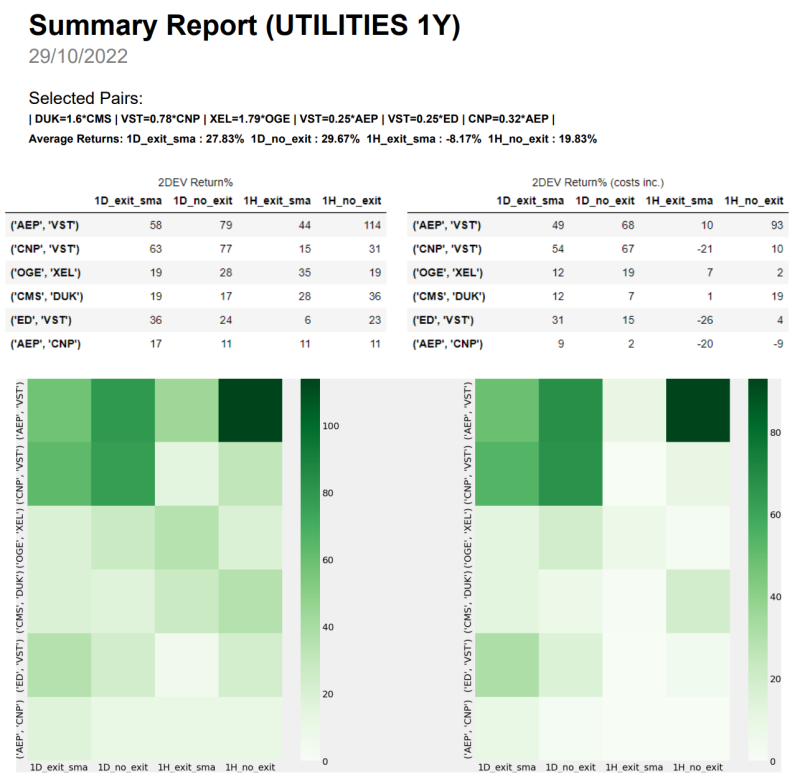
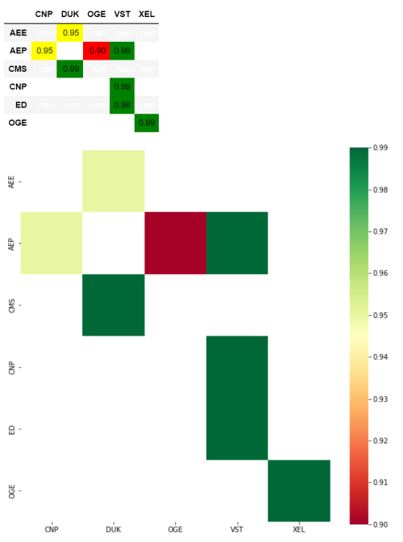

# Pair Trading Analysis & Exercises Toolkit for Jupyter Notebook

# Use Cases

- Pair Selection (Identify cointegrated pairs)
- Download & save ticker data by using yfinance
- Merge and manipulate data for detailed pair analysis
- Analyze pairs , residuals, perform unit root & cointegration tests
- Backtest & Summary Report:

# Considerations

Considering for the next version:

- implement multi resolution strategies (1D & 1H together)
- live signal generator for selected strategies
- analyze earnings & news effect to pair spread
- outlier pruning
- more training & testing sets

# Requirements

* arch==5.3.1
* matplotlib==3.4.3
* numpy==1.20.3
* pandas==1.3.4
* seaborn==0.11.2
* statsmodels==0.12.2
* yfinance==0.1.77
* dataframe-image==0.1.3
* fpdf==1.7.2
* termcolor==2.0.1
* plotly==5.10.0
* pandas-ta==0.3.14b0

